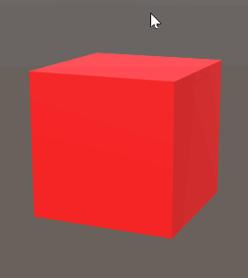
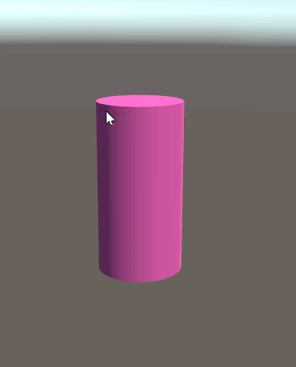

# Mesh Cutter

A proof-of-concept Unity project for a mesh cutting algorithm. 
This is a simple implementation of an algorithm that splits in 2 any 3d manifold objects with genus 0.
The split is done using a plane defined by the line drawn by the user and a depth in the same direction as the camera facing forward
(i.e. when we draw a line, we don't see the generated plane since it's perfectly aligned with the camera and the line)

## Implementation

For each object tagged as *sliceable*:

* We create 2 new meshes : a *positive* mesh, which is on the positive side of the slice plane, and a *negative* mesh, which is on the other side.

* We go through each triangle of the mesh and, if it intersects the plane, we separate it into 3 triangles : 2 on the bigger side of the cut and 1 on the other side (we assume that it can't be cut perfectly in 2 triangles).  If the triangle doesn't intersect with the plane, we simply store it in its respective mesh (positive or negative). We also keep a list of the newly created vertices, which will all lie on the boundary of the meshes.

* We then create new triangles to form the boundary face (the new face generated by the cut). There is currently 2 different ways of generating the boundary face (generating a center vertex, or creating triangles fans by iterating through sorted pairs of vertices), but both of them works mostly only for a convex polygon.

* Finally we create new objects for the new meshes and push them apart by a small value (indicated by the *separation* property in the MouseSlice script)

## Examples

Here are a few examples of simple shapes being cut.

| Cylinder  | Refractive Sphere  | Toonlit Suzanne  |
|---|---|---|
|   |  |   |

Note
* The material used for the sphere is _GlassRefractive_ from Unity's Standard Assets
* The material used for Suzanne monkey is _ToonLit_ from Unity's Standard Assets
* Those materials are used in the project's scenes, but are not included in this repo. If you want to experiment with them, import the following folders from the Standard Assets:
  * Effects/GlassRefraction
  * Effects/ToonShading
  * Prototyping/Materials
  * Prototyping/Textures

## Future work

Here are some of the things that could be worked on or improved: 

* Use a new submesh to add a sliced surface so that we can set a separate material for it.

* Smooth-shading on the sliced boundary is not preserved since we compute  

* Handling cuts on manifold objects of genus 1 and above. This would mostly imply detecting the number of boundaries made by cutting the object and associating vertices with their respective boundaries;

* Handling non-convex sliced polygons on the surface generated by the slice. The algorithm used right now works mostly for convex polygons. Using a better triangulation algorithm could help (e.g. ear-clipping triangulation);

* Optimize the cutting algorithm. It could be interesting to treat triangles as part of a face, such that when we cut through a face, we could recompute triangles based on the face's shape so that we get an efficient number of triangles. This would also help generate better boundaries;

* Using Unity's Job System to parallelize the cutting process (since the algorithm is relatively slow);
